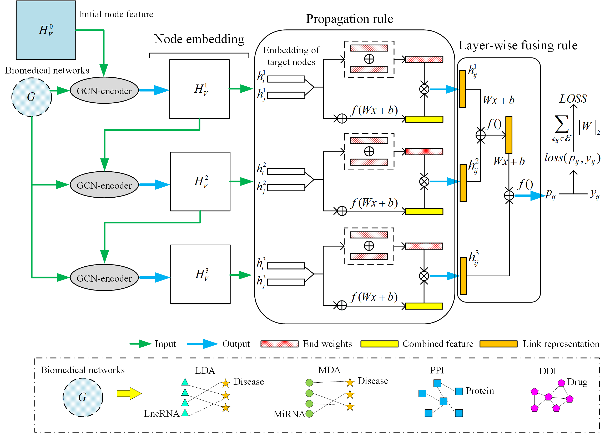

## LR-GNN: a graph neural network based on link representation for predicting molecular associations

### Overview
This repository contains codes necessary to run the CGNN algorithm. 

### Running Environment
* Windows environment, Python 3
* PyTorch >= 1.3.1

### Datasets
All datasets are available at [data](http://bioinfo.nankai.edu.cn/kangcz.html).

### Model Framework

Fig.1. The workflow of LR-GNN. The layer number of illustrated LR-GNN is 3. $f()$ is a activation function and $Wx+b$ denotes the linear transformation.

### Contacts
Please send any questions you might have about the code and/or the algorithm to [kangchuanze@mail.nankai.edu.cn](kangchuanze@mail.nankai.edu.cn).

